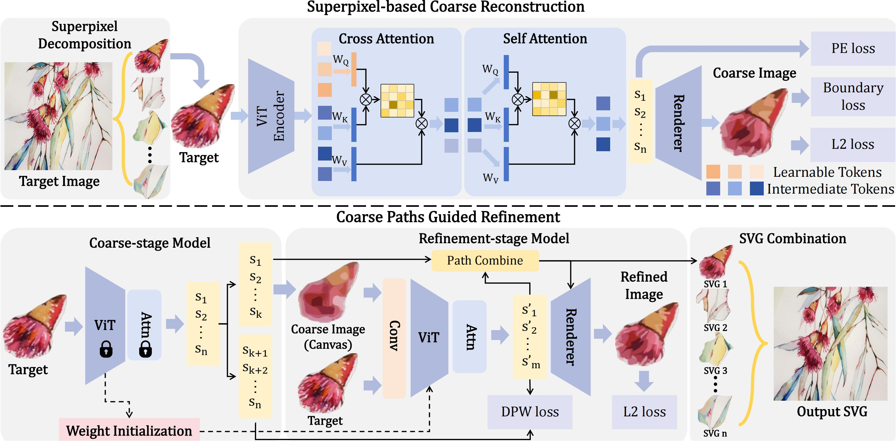

# SuperSVG: Superpixel-based Scalable Vector Graphics Synthesis

###  [Paper](https://arxiv.org/abs/2404.15789) |   [Page](https://sjtuplayer.github.io/projects/MotionMaster/)
<!-- <br> -->
[Teng Hu](https://github.com/sjtuplayer),
[Ran Yi](https://yiranran.github.io/),
[Baihong Qian](https://github.com/CherryQBH), 
[Jiangning Zhang](https://zhangzjn.github.io/),
[Paul L. Rosin](https://scholar.google.com/citations?hl=zh-CN&user=V5E7JXsAAAAJ),
[Yu-Kun Lai](https://scholar.google.com/citations?user=0i-Nzv0AAAAJ&hl=zh-CN&oi=sra)
<!-- <br> -->




# Prepare

```bash
pip install wandb
conda create -n live python=3.7
conda activate live
conda install -y pytorch torchvision -c pytorch
conda install -y numpy scikit-image
conda install -y -c anaconda cmake
conda install -y -c conda-forge ffmpeg
pip install svgwrite svgpathtools cssutils numba torch-tools scikit-fmm easydict visdom
pip install opencv-python==4.5.4.60  # please install this version to avoid segmentation fault.

cd DiffVG
git submodule update --init --recursive
python setup.py install
cd ..
```


## Training Step

### (0) Prepare
Data prepare: Download the [ImageNet](https://image-net.org) dataset.

### (1) Train the Coarse-stage Model

Put the downloaded Imagenet or any dataset you want into `$path_to_the_dataset`. 
Then, you can train the coarse-stage model by running:

```
python3 main_coarse.py --data_path=$path_to_the_dataset
```

After training, the checkpoints and logs are saved in the directory `output_coarse`.

### (2) Train the Refinement-stage Model

Coming soon
[//]: # (With the trained coarse-stage model, you can train the refinement-stage model by running:)

[//]: # ()
[//]: # (```)

[//]: # (python3 main_refine --data_path=$path_to_the_dataset)

[//]: # (```)

[//]: # ()
[//]: # (After training, the checkpoints and logs are saved in the directory `output_refine`.)

## Citation

If you find this code helpful for your research, please cite:

```
@inproceedings{hu2024supersvg,
      title={SuperSVG: Superpixel-based Scalable Vector Graphics Synthesis}, 
      author={Teng Hu Ran Yi and Baihong Qian and Jiangning Zhang and Paul L. Rosin and Yu-Kun Lai},
      booktitle={Proceedings of the IEEE Conference on Computer Vision and Pattern Recognition},
      year={2024}
}
```
